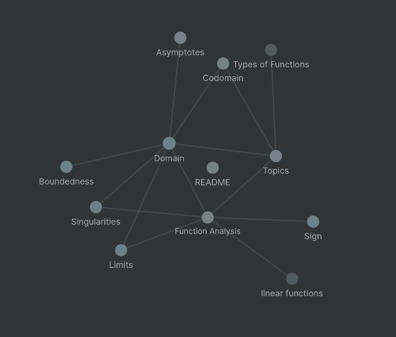

# Description
Digital garden containing most of the high school level math that I know. Made public for everyone to use.

This repo should be very useful if you're trying to refresh on some concepts, as everything is short and sweet and very organized.

I wrote this whole thing in [Obsidian](https://obsidian.md), a very useful tool for writing notes, with some nice features such as front and backlinks, meaning that every note can be connected to every other note. This makes it so that every concept can be referenced in every other note, which makes obsidian very useful when organizing large knowledge bases with a lot of short, interconnected topics, such as mathematics.

It also generates very nice graphs, such as this one:

Which are very pretty to look at, and give a nice overview of the relations between the concepts.

Even though I used Obsidian, all files are written in utf-8 encoded .md files, which are just text files, so you can view this in any text editor(although without any of the nice features).

# Notation
[[Something]] means that \<Something\> is a page. The double brackets create the link in Obsidian. If you aren't viewing this in Obsidian, just know that if you find something written inside double brackets, there is a note about it(or there will be if I haven't written it yet).

Also note that when I use quotes, (" "), it means that I'm using wrong mathematical language, a good example of this would be "the domain is the opposite of the codomain". It doesn't actually mean anything, but it gets the point across.

# Roadmap

I will cover all topics covered in the IB program and Italian high school program, since that's what I'm doing.

Turning this into a website is also on the roadmap:
- https://dev.to/yordiverkroost/publish-your-obsidian-vault-to-your-digital-garden-5bf8
- https://github.com/maximevaillancourt/digital-garden-jekyll-template/blob/master/_plugins/bidirectional_links_generator.rb

# Errors
Report any bugs/corrections in the [Issue page](https://github.com/Ferryistaken/mahematics-vault/issues).